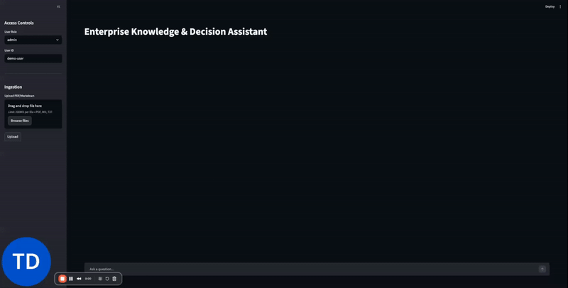
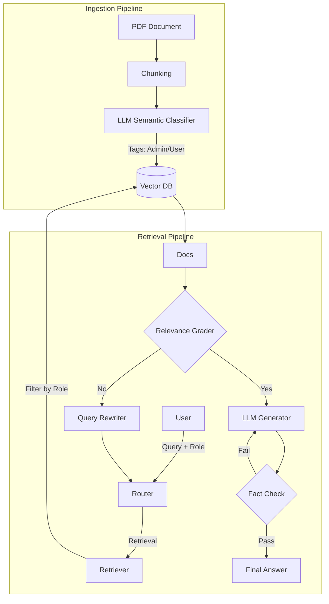

# 🛡️ Enterprise RAG Agent with RBAC & Self-Correction


> **A production-ready RAG system that knows *who* you are.**
> Solves the "Intern accessing CEO's Bonus" problem using Semantic Access Control and Graph-based reasoning.

---

## 🎥 Project Demo



---

## 💡 The Problem
Standard RAG (Retrieval-Augmented Generation) systems are often "blind" to permissions. Once a document is indexed, anyone can ask about it. In a corporate environment, this is a security nightmare. An intern shouldn't be able to query *"What is the projected acquisition target for Q3?"* and get an answer just because the document exists in the vector database.

## 🚀 The Solution
This project implements a **Role-Based Access Control (RBAC)** RAG Agent. It doesn't just "hide" the answer; it enforces security at the **retrieval level** using semantic analysis.

### Key Features
* **🔐 Semantic Access Control:**
    * Instead of brittle keyword lists, an ingestion agent (LLM) reads every document chunk and classifies it (e.g., *Confidential*, *Internal*, *Public*) before indexing.
* **🕸️ Agentic Workflow (LangGraph):**
    * The system uses a graph-based state machine. It includes **Self-Correction**, **Hallucination Grading**, and **Query Rewriting**. If the retrieved documents aren't relevant, the agent rewrites the query and tries again.
* **👤 Multi-Role Simulation:**
    * Simulate different users (`Intern`, `Employee`, `Admin`) to test security boundaries in real-time.
* **🧠 Decision Intelligence:**
    * Capable of complex reasoning (e.g., "Calculate the CEO's bonus based on the net profit" -> retrieves two separate confidential facts and computes the answer).

---

## 🏗️ Architecture

The system consists of two main pipelines: **Ingestion** (Write) and **Retrieval/Generation** (Read).



## 🧪 Scenarios (Tested)
We tested the system with a Global_Handbook_2025.pdf containing public policies and confidential financial data.

Role|Query|Expected Result|System Behavior
---|---|---|---
Intern|"What is the password policy?"|✅ Answer|Retrieved from Page 1 (Public Tag).
Intern|"What is the acquisition target?"|❌ Denied|Semantic Filter: Blocked 'Admin' chunks. Returned "I don't know".
Employee|"Cost of Gold Health Plan?"|✅ Answer|Retrieved from Page 2 (Internal Tag).
Admin|"What is the acquisition target?"|✅ Answer|Retrieved from Page 3 (Confidential Tag).
Admin|"Calculate CEO Bonus"|🧠 Reasoning|Retrieved Profit + Bonus Rate -> Calculated Result.

## 🛠️ Tech Stack
Orchestration: LangChain & LangGraph  
LLMs: OpenAI GPT-4o (Reasoning), GPT-4o-mini (Routing/Grading)  
Vector Database: Weaviate / Pinecone (with Metadata Filtering)  
Frontend: Streamlit  
Async Processing: Celery (for document ingestion)

## 🚀 Getting Started
### 1. Clone the Repo
```bash
git clone [https://github.com/YOUR_USERNAME/enterprise-rag-agent.git](https://github.com/YOUR_USERNAME/enterprise-rag-agent.git)
cd enterprise-rag-agent
```

### 2. Environment Setup
Create a `.env` file:
```bash
OPENAI_API_KEY=sk-proj-...
# Add your Vector DB credentials here
```

### 3. Install Dependencies
```bash
pip install -r requirements.txt
```

### 4. Run the Application
Start the Backend Worker (for ingestion) and Frontend:
```bash
# Terminal 1: Start Celery Worker
celery -A app.ingestion.worker.celery_app worker -l info

# Terminal 2: Start UI
streamlit run app/ui/streamlit_app.py
```

Made with ❤️ by Iremsu Savas

---

Just one thing to mention is remove .env and all the api key usages before uploading to pipedrive, also use gitignore
